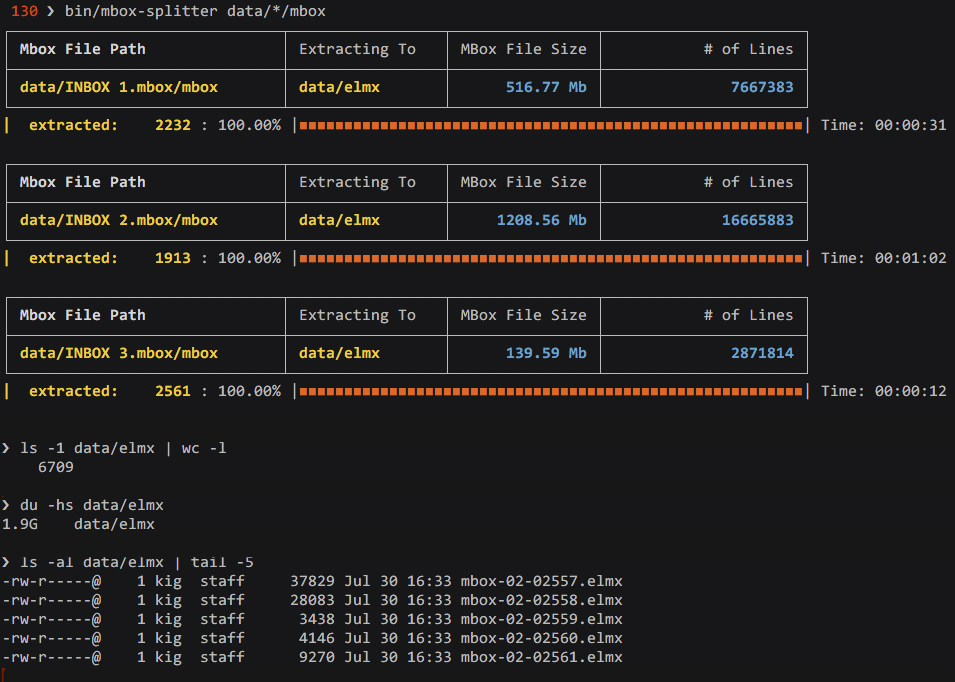
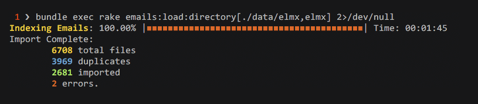

## Email Search 

[](http://travis-ci.org/kigster/search-emlx-mailbox)

Email Search is a simple rails application, whose goal is to provide fast and effective search across many email messages saved in a standard ASCII text format, one file per message, where mail header and the body are separated by two newlines.

For example, \*.emlx format used by Apple Mail works great.  This app provides an easy way to import these messages from a directory to the database, and then uses Apache Solr to search imported messages using full text search.

## Motivation

> From the Author: A while back, I was tasked with digging through a whole lot (tens of thousands) of very old email, and searching for relevant items. I start with using `grep`, `awk`, and `find`, which quickly became complete nuisance. I wanted to search case insensitively, including terms, excluding terms, using full text search and natural language capabilities of modern search engines.

> Having had recent experience with Solr and the Sunspot gem, I decided to write a tiny Rails app to do just that.  And then I thought, hell, maybe someone else will need to do this too.  So I decided to make it into a "proper" app, write some tests, and open source it.

The result is a rather simple but effective Rails app, that supports sophisticated full-text searches
powered by Solr search engine (which itself is powered by Sunspot ruby gem). It offers a convenient screen viewport for scanning through email content that match search, with a UI based on Twitter Bootstrap.  You can then export the results that match a particular search criteria using the "Download" button, which creates a zip file that includes matching email messages, and then sends it to the browser.

## Dependencies


 * Unix-like system (it wouldn't be too hard to port this to Windows, by we are using a couple of UNIX tools like `wc`).
 * Rails 5.2
 * Ruby 2.5.1
 * A recent install of PostgreSQL, which is the default database engine, but you can change it to anything else in `database.yml`, as no PostgreSQL-specific features are being used.

## Usage

### Before You Begin

You must first:

 1. Clone the app using git (on a Mac, it requires running `xcode-select --install` first to get `git` and other dev tools).
 
 2. Then `cd` into the app foler and run:
 
  ```bash
    # basic dependencies
    $ brew install rbenv ruby-build postgres
    $ brew services start postgres
        
    # if you don't have a recent ruby
    $ rbenv install 2.5.1
    $ gem install bundler
     
    $ bundle install   # to install all dependencies
    $ rake reset       # to reset database and Solr
  ``` 
        
 3. The last step is to start the application using Foreman:        

        $ foreman start 
        
    You'd want to do this in a separate window, and use another terminal window for subsequent commands.

 
### Dealing with Mbox-Formatted Mailboxes

Next, you must already have, or you can create a directory that contains all of your `*.elmx` files. 

If you use **OS-X Mail Export** feature, you will most likely end up with a folder containing your emails in the "mbox" format, instead of having emails as individual "*.elmx" files:

Let's assume that I performed an export of my OS-X Mail Inbox into a folder named `data`. Then when it finishes, I should see the following in my `data` folder:

```bash
$ find data -print  
data/INBOX 1.mbox/mbox
data/INBOX 1.mbox/table_of_contents
data/INBOX 2.mbox/mbox
data/INBOX 2.mbox/table_of_contents
data/INBOX 3.mbox/mbox
data/INBOX 3.mbox/table_of_contents 
```

There are three parts, and each contains a giant file `mbox` which contains our email messages in the raw format. Each of these messages now needs to be extracted into an individual file with `*.elmx` extension.

To achieve that, we provided a command line tool `mbox-splitter` that works like a charm :) 

You run it and pass it one or more paths to mbox files you want to split. It creates a new folder `elmx` two levels above each `mbox` file and populates it with indiviaul files, as it goes through each mbox:

```bash
# Usage
$ bin/mbox-splitter mbox-file [ mbox-file ] ....

# Example:
$ bin/mbox-splitter data/*.mbox/mbox
```

You should see something like this below:



In other words, the splitter will do it's job and extract all individual emails into the `data/elmx` folder, naming each extracted email as `mbox-YY-XXXXXXX`, where `YY` is the file number, and `XXXXXX` is the index of the extracted email.

As a result of this process, you will end up with a flat folder `data/elmx` containing possibly tens of thousands of emails, split into individual files. Now we can start indexing them.

### Indexing Emails for Search

In this step, you should have a directory containing a bunch of `*.emlx` files you want import. This could be a flat directory, or recursive.

Run:
  
    $ bundle exec rake emails:load:directory[folder,extension] 2>/dev/null
        
Example:
    
    $ bundle exec rake emails:load:directory[./data/elmx,elmx] 2>/dev/null
    
This should display a progress bar, as files are being imported and indexed by Solr. The reason we pipe standard error to `/dev/null` is because of various warnings that pollute the screen otherwise.
    
Below is an example of a successful import:
    

    
     
### Searching for Emails    
  
  * Connect to [http://localhost:3000/](http://localhost:3000/)
  
  * Search, refine your search, hover over matching emails to view them, search again.
  
  * Results of any search query can be exported as a zip file and downloaded.

### Screen Shot

Below is a sample screen shot with the Rails application running.


## Testing

To run the tests either run `bundle exec rspec` (this skips Solr tests), or to test with Solr enabled, run:

```bash
$ TESTS_SOLR=true rspec
```

## Contributing

1. Fork it
2. Create your feature branch (`git checkout -b my-new-feature`)
3. Commit your changes (`git commit -am 'Added some feature'`)
4. Push to the branch (`git push origin my-new-feature`)
5. Create new Pull Request

## Author

Konstantin Gredeskoul, http://github.com/kigster

## License

See the LICENSE file.

